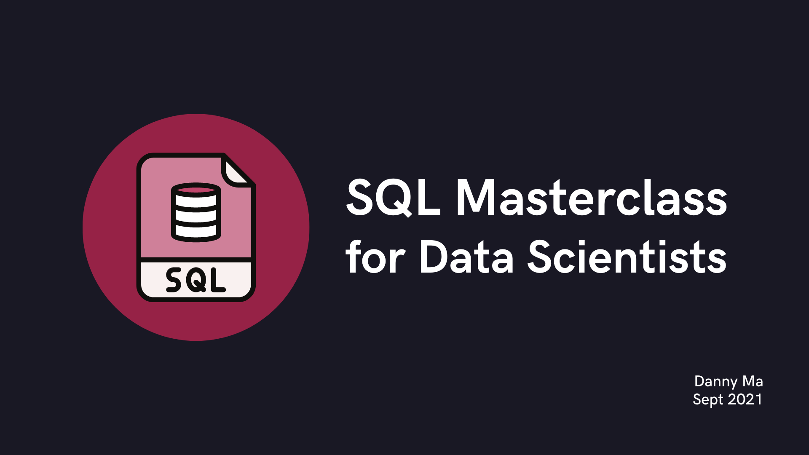

<p align="center">
    
</p>

[]()
[]()
[]()
[]()

# Step 1 - Introduction

## Our Database

All of our data lives within a PostgreSQL database and contains a single schema called `trading`.

In PostgreSQL, a database can contain multiple schemas, and a schema is a collection of tables and other database objects.

## Copy and Run a SQL Query

To run our first query together - you can click on the right hand corner of the following code snippet below to copy a basic `SELECT` query to your clipboard.

You can then paste it into your SQLPad interface and click on the `Run` button in the top right corner or hit `cmd` + `enter` on Mac or `control` + `enter` on Windows to run the query.

```sql
SELECT * FROM trading.members;
```

This `SELECT` query above will return all of the records from the `members` table inside the `trading` schema.

# Our Crypto Case Study

For this entire SQL Simplified course we will focus on our Cryptocurrency Trading SQL Case Study!

## Setting the Context

In our fictitious (but realistic) case study - my team of trusted data mentors from the Data With Danny team have been dabbling in the crypto markets since 2017.

Our main purpose for this case study is to analyse the performance of the DWD mentors over time and to "slice and dice" the data in various ways to investigate other questions we might want answers to!

## Our Datasets

All of our data for this case study exists within the `trading` schema as we mentioned in the previous tutorial.

There are 3 data tables available to us in this schema which we can use to run our SQL queries with:

1. `members`
2. `prices`
3. `transactions`

You can inspect each dataset by copying the following code snippet below and running it directly in the SQLPad GUI - please make sure to overwrite any previous queries which are already in the SQL interface!

```sql
SELECT * FROM trading.members;
```

```sql
SELECT * FROM trading.prices LIMIT 5;
```

```sql
SELECT * FROM trading.transactions LIMIT 5;
```

Note: the `LIMIT 5` in the above queries will return us only the first 5 rows from each dataset.

It is a good practice to always `LIMIT` your queries just in case the tables are huge - you don't want to be trying to return all 5 million rows from a huge table when you are just inspecting the data for the first time!

## A Note on Schemas

Notice above how the "`trading.`" is included before each of our available tables.

If we were to remove this - our database will be unable to find our tables.

This query below will return you an error when ran:

```sql
SELECT * FROM members;
```

> relation "members" does not exist

In realistic scenarios - physical tables will almost always live within a schema and we'll need to reference the schema name to run our queries properly!

[](https://github.com/datawithdanny/sql-masterclass/tree/main/course-content/step2.md)