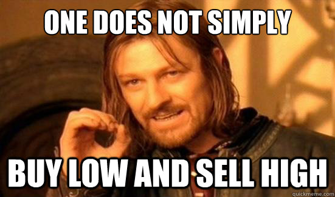

<p align="center">
    
</p>

[]()
[]()
[]()
[]()

# Step 11 - The Trader Strategy

[](https://github.com/datawithdanny/sql-masterclass/tree/main/course-content/step10.md)
[](https://github.com/datawithdanny/sql-masterclass/tree/main/course-content/step12.md)

# Scenario 3: The Trader



Nandita is the Queen of crypto trading - she wants to follow the popular trader's adage of **BUY LOW, SELL HIGH**

## Nandita's Transaction History

* She also starts out with a 50 BTC and ETH purchase just like Leah and Vikram
* She continues to buy more crypto over the 4 years
* She starts selling some of her crypto portfolio to realise gains

## Nandita's Data

This final scenario 3 is actually exactly the same as our real `trading.transactions` dataset!

To complete our individual scenarios before we calculate all our metrics for all mentors - let's also prepare another temp table called `nandita_trading_strategy`

```sql
CREATE TEMP TABLE nandita_trading_strategy AS
SELECT * FROM trading.transactions
WHERE member_id = 'a87ff6';
```

You can inspect the data by running the following query after creating the temp table above:

```sql
SELECT * FROM nandita_trading_strategy;
```

## Final Evaluation Metrics

By the end of our assessment period on the 29th of August 2021 - we can calculate Nandita's metrics as follows for each individual BTC and ETH portfolio:

* Count of buy and sell transactions
* Total investment amount of purchases
* The dollar amount of fees for purchase transactions
* Dollar cost average of purchases
* Total gross revenue of sell transactions
* Average sell price for each unit sold
* Final portfolio value and quantity
* Profitability measured as (final portfolio value + gross sales revenue - purchase fees - sales fees) / initial investment amount

**Bonus Question**

We also want to calculate the difference if Nandita didn't sell any of her crypto and compare it to the final value at the end of August - how much does this impact her overall profitability?

## Solutions

### Question 1

> Calculate Nandita's purchase metrics for each of her BTC and ETH portfolios:
>
> * Count of purchase transactions
> * Initial investment
> * Purchase fees
> * Dollar cost average of purchases

<details><summary>Click here to reveal the solution!</summary><br>

```sql
WITH cte_purchases AS (
  SELECT
    transactions.ticker,
    COUNT(*) AS purchase_count,
    SUM(transactions.quantity) AS purchase_quantity,
    SUM(transactions.quantity * prices.price) AS initial_investment,
    SUM(transactions.quantity * prices.price * transactions.percentage_fee / 100) AS purchase_fees
  FROM nandita_trading_strategy AS transactions
  INNER JOIN trading.prices
    ON transactions.ticker = prices.ticker
    AND transactions.txn_date = prices.market_date
  WHERE transactions.txn_type = 'BUY'
  GROUP BY transactions.ticker
)
SELECT
  ticker,
  purchase_count,
  purchase_quantity,
  initial_investment,
  purchase_fees,
  initial_investment / purchase_quantity AS dollar_cost_average
FROM cte_purchases;
```

</details><br>

### Question 2

> Calculate Nandita's sales metrics for each of her BTC and ETH portfolios:
>
> * Count of sales transactions
> * Gross revenue amount
> * Sales fees
> * Average selling price

<details><summary>Click here to reveal the solution!</summary><br>

```sql
WITH cte_sales AS (
  SELECT
    transactions.ticker,
    COUNT(*) AS sales_count,
    SUM(transactions.quantity) AS sales_quantity,
    SUM(transactions.quantity * prices.price) AS gross_revenue,
    SUM(transactions.quantity * prices.price * transactions.percentage_fee / 100) AS sales_fees
  FROM nandita_trading_strategy AS transactions
  INNER JOIN trading.prices
    ON transactions.ticker = prices.ticker
    AND transactions.txn_date = prices.market_date
  WHERE transactions.txn_type = 'SELL'
  GROUP BY transactions.ticker
)
SELECT
  ticker,
  sales_count,
  sales_quantity,
  gross_revenue,
  sales_fees,
  gross_revenue / sales_quantity AS average_selling_price
FROM cte_sales;
```

</details><br>


### Question 3

> What is Nandita's final BTC and ETH portfolio value and quantity?

<details><summary>Click here to reveal the solution!</summary><br>

```sql
WITH cte_adjusted_transactions AS (
  SELECT
    member_id,
    txn_date,
    txn_type,
    ticker,
    percentage_fee,
    CASE
      WHEN txn_type = 'BUY' THEN quantity
      WHEN txn_type = 'SELL' THEN -quantity
    END as quantity
  FROM nandita_trading_strategy
)
SELECT
  transactions.ticker,
  SUM(transactions.quantity) AS final_quantity,
  SUM(transactions.quantity * prices.price) AS final_portfolio_value
FROM cte_adjusted_transactions AS transactions
INNER JOIN trading.prices
  ON transactions.ticker = prices.ticker
WHERE prices.market_date = '2021-08-29'
GROUP BY transactions.ticker;
```

</details><br>

### Question 4 & 5 (bonus!)

> What is Nandita's overall profitability and theoretical profitability if she didn't sell any of her portfolio?

We will try to minimise how many times we access the temp table `nandita_trading_strategy` to optimise our query performance!

<details><summary>Click here to reveal the solution!</summary><br>

```sql
WITH cte_portfolio AS (
  SELECT
    transactions.ticker,
    transactions.txn_type,
    COUNT(*) AS transaction_count,
    SUM(transactions.quantity) AS total_quantity,
    SUM(transactions.quantity * prices.price) AS gross_values,
    SUM(transactions.quantity * prices.price * transactions.percentage_fee / 100) AS fees 
  FROM nandita_trading_strategy AS transactions
  INNER JOIN trading.prices
    ON transactions.ticker = prices.ticker
    AND transactions.txn_date = prices.market_date
  GROUP BY 1,2
),
cte_summary AS (
  SELECT
    ticker,
    SUM(
      CASE
        WHEN txn_type = 'BUY' THEN total_quantity
        WHEN txn_type = 'SELL' THEN -total_quantity
      END
    ) AS final_quantity,
    SUM(CASE WHEN txn_type = 'BUY' THEN gross_values ELSE 0 END) AS initial_investment,
    SUM(CASE WHEN txn_type = 'SELL' THEN gross_values ELSE 0 END) AS sales_revenue,
    SUM(CASE WHEN txn_type = 'BUY' THEN fees ELSE 0 END) AS purchase_fees,
    SUM(CASE WHEN txn_type = 'SELL' THEN fees ELSE 0 END) AS sales_fees,
    SUM(CASE WHEN txn_type = 'BUY' THEN total_quantity ELSE 0 END) AS purchase_quantity,
    SUM(CASE WHEN txn_type = 'SELL' THEN total_quantity ELSE 0 END) AS sales_quantity,
    SUM(CASE WHEN txn_type = 'BUY' THEN transaction_count ELSE 0 END) AS purchase_transactions,
    SUM(CASE WHEN txn_type = 'SELL' THEN transaction_count ELSE 0 END) AS sales_transactions
  FROM cte_portfolio
  GROUP BY ticker
),
cte_metrics AS (
  SELECT
    summary.ticker,
    summary.final_quantity * final.price AS actual_final_value,
    summary.purchase_quantity * final.price AS theoretical_final_value,
    summary.sales_revenue,
    summary.purchase_fees,
    summary.sales_fees,
    summary.initial_investment,
    summary.purchase_quantity,
    summary.sales_quantity,
    summary.purchase_transactions,
    summary.sales_transactions,
    summary.initial_investment / purchase_quantity AS dollar_cost_average,
    summary.sales_revenue / sales_quantity AS average_selling_price
  FROM cte_summary AS summary
  INNER JOIN trading.prices AS final
    ON summary.ticker = final.ticker
  WHERE final.market_date = '2021-08-29'
)
SELECT
  ticker,
  actual_final_value AS final_portfolio_value,
  ( actual_final_value + sales_revenue - purchase_fees - sales_fees ) / initial_investment AS actual_profitability,
  ( theoretical_final_value - purchase_fees ) / initial_investment AS theoretical_profitability,
  dollar_cost_average,
  average_selling_price,
  sales_revenue,
  purchase_fees,
  sales_fees,
  initial_investment,
  purchase_quantity,
  sales_quantity,
  purchase_transactions,
  sales_transactions
FROM cte_metrics;
```

</details><br>

[](https://github.com/datawithdanny/sql-masterclass/tree/main/course-content/step10.md)
[](https://github.com/datawithdanny/sql-masterclass/tree/main/course-content/step12.md)