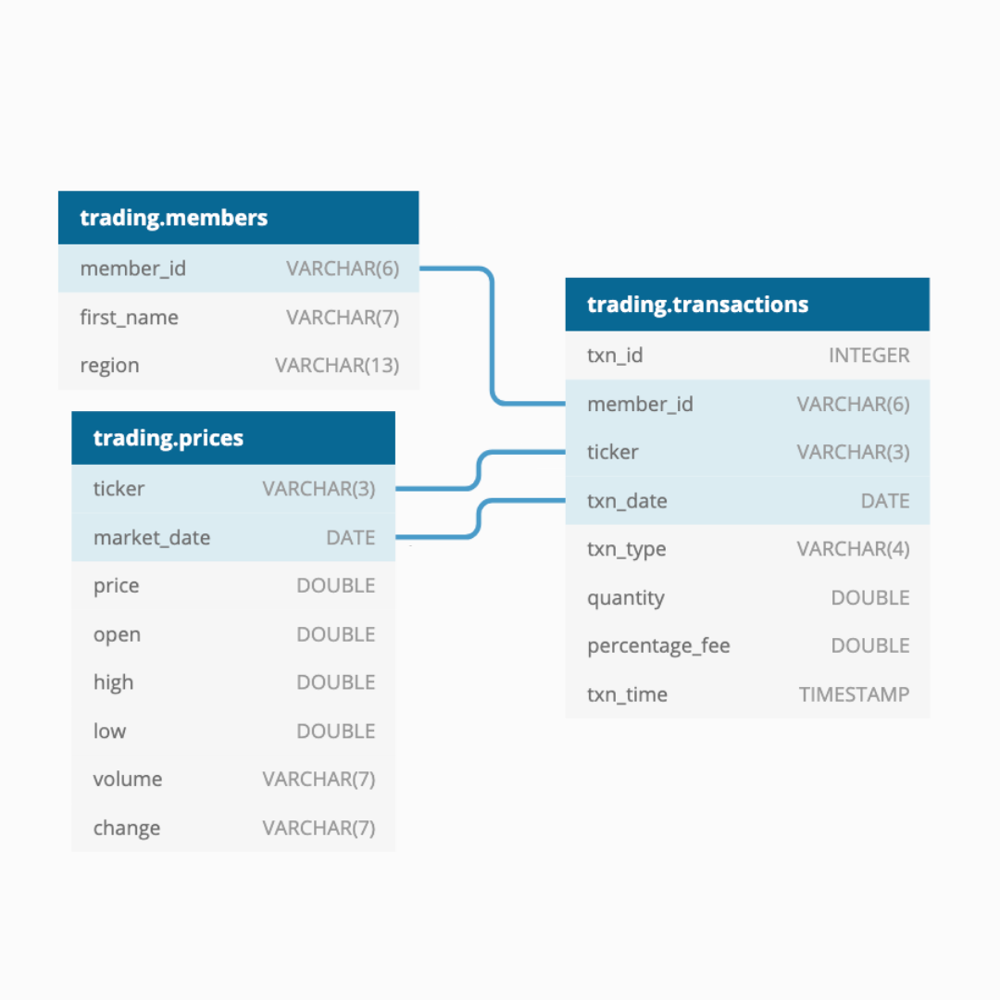

<p align="center">
    
</p>

[]()
[]()
[]()
[]()

# Step 7 - Answering Data Questions

[](https://github.com/datawithdanny/sql-masterclass/tree/main/course-content/step6.md)
[](https://github.com/datawithdanny/sql-masterclass/tree/main/course-content/step8.md)

# Answering the Questions

Before running any of the solution queries below for this tutorial's questions - you can run the entire SQL prep queries directly below!

<details><summary>Click here to reveal the entire data prep SQL script!</summary><br>

```sql
DROP TABLE IF EXISTS temp_portfolio_base;
CREATE TEMP TABLE temp_portfolio_base AS
WITH cte_joined_data AS (
  SELECT
    members.first_name,
    members.region,
    transactions.txn_date,
    transactions.ticker,
    CASE
      WHEN transactions.txn_type = 'SELL' THEN -transactions.quantity
      ELSE transactions.quantity
    END AS adjusted_quantity
  FROM trading.transactions
  INNER JOIN trading.members
    ON transactions.member_id = members.member_id
  WHERE transactions.txn_date <= '2020-12-31'
)
SELECT
  first_name,
  region,
  (DATE_TRUNC('YEAR', txn_date) + INTERVAL '12 MONTHS' - INTERVAL '1 DAY')::DATE AS year_end,
  ticker,
  SUM(adjusted_quantity) AS yearly_quantity
FROM cte_joined_data
GROUP BY first_name, region, year_end, ticker;

DROP TABLE IF EXISTS temp_cumulative_portfolio_base;
CREATE TEMP TABLE temp_cumulative_portfolio_base AS
SELECT
  first_name,
  region,
  year_end,
  ticker,
  yearly_quantity,
  SUM(yearly_quantity) OVER (
    PARTITION BY first_name, ticker
    ORDER BY year_end
    ROWS BETWEEN UNBOUNDED PRECEDING AND CURRENT ROW
  ) AS cumulative_quantity
FROM temp_portfolio_base;
```

</details><br>

Here is the ERD diagram below just in case you forgot about how all the tables are joined together!



## Question 1

> What is the total portfolio value for each mentor at the end of 2020?

We can now inner join our `trading.prices` table (I hope you haven't forgot about this one yet!) to our new temp table `temp_cumulative_portfolio_base`

Let's also order our results by highest portfolio value to lowest rounded to 2 decimal places.

<details><summary>Click here to reveal the solution!</summary><br>

```sql
SELECT
  base.first_name,
  ROUND(
    SUM(base.cumulative_quantity * prices.price),
    2
  ) AS portfolio_value
FROM temp_cumulative_portfolio_base AS base
INNER JOIN trading.prices
  ON base.ticker = prices.ticker
  AND base.year_end = prices.market_date
WHERE base.year_end = '2020-12-31'
GROUP BY base.first_name
ORDER BY portfolio_value DESC;
```

</details><br>

| first_name | portfolio_value |
| ---------- | --------------- |
| Nandita    |    105391731.03 |
| Leah       |    100724284.81 |
| Ayush      |    100071736.51 |
| Abe        |     95203693.60 |
| Ben        |     92722998.25 |
| Enoch      |     88346609.78 |
| Vikram     |     88000702.69 |
| Danny      |     84696448.83 |
| Sonia      |     67932183.73 |
| Rowan      |     67241367.69 |
| Charlie    |     66761769.49 |
| Alex       |     54857750.71 |
| Vipul      |     43123911.62 |
| Pavan      |     41764439.70 |
<br>

## Question 2

> What is the total portfolio value for each region at the end of 2019?

Let's also perform the same ordering and rounding for this query too.

<details><summary>Click here to reveal the solution!</summary><br>

```sql
SELECT
  base.region,
  ROUND(
    SUM(base.cumulative_quantity * prices.price),
    2
  ) AS portfolio_value
FROM temp_cumulative_portfolio_base AS base
INNER JOIN trading.prices
  ON base.ticker = prices.ticker
  AND base.year_end = prices.market_date
WHERE base.year_end = '2019-12-31'
GROUP BY base.region
ORDER BY portfolio_value DESC;
```

</details><br>

|    region     | portfolio_value |
| ------------- | --------------- |
| United States |     98795362.60 |
| Australia     |     52861452.00 |
| Asia          |     18305366.24 |
| India         |     16168831.76 |
| Africa        |     16078915.65 |
<br>

## Question 3

> What percentage of regional portfolio values does each mentor contribute at the end of 2018?

Let's make our percentages between 0 and 100, rounded to decimal places - order the output with the regions with highest portfolio value first and then by descending mentor contributions within each group.

<details><summary>Click here to reveal the solution!</summary><br>

```sql
WITH cte_mentor_portfolio AS (
  SELECT
    base.region,
    base.first_name,
    ROUND(
      SUM(base.cumulative_quantity * prices.price),
      2
    ) AS portfolio_value
  FROM temp_cumulative_portfolio_base AS base
  INNER JOIN trading.prices
    ON base.ticker = prices.ticker
    AND base.year_end = prices.market_date
  WHERE base.year_end = '2018-12-31'
  GROUP BY base.first_name, base.region
),
cte_region_portfolio AS (
SELECT
  region,
  first_name,
  portfolio_value,
  SUM(portfolio_value) OVER (PARTITION BY region) AS region_total
FROM cte_mentor_portfolio
)
-- final output
SELECT
  region,
  first_name,
  ROUND(100 * portfolio_value / region_total, 2) AS contribution_percentage
FROM cte_region_portfolio
ORDER BY region_total DESC, contribution_percentage DESC;
```

</details><br>

|    region     | first_name | contribution_percentage |
| ------------- | ---------- | ----------------------- |
| United States | Nandita    |                   20.00 |
| United States | Ayush      |                   18.61 |
| United States | Abe        |                   17.45 |
| United States | Rowan      |                   14.34 |
| United States | Charlie    |                   12.52 |
| United States | Alex       |                   10.00 |
| United States | Vipul      |                    7.08 |
| Australia     | Danny      |                   31.55 |
| Australia     | Ben        |                   30.41 |
| Australia     | Sonia      |                   24.53 |
| Australia     | Pavan      |                   13.51 |
| Asia          | Leah       |                  100.00 |
| Africa        | Enoch      |                  100.00 |
| India         | Vikram     |                  100.00 |
<br>

## Question 4

> Does this region contribution percentage change when we look across both Bitcoin and Ethereum portfolios independently at the end of 2017?

We can use a similar approach to question 3 - but we will need to avoid the first level of aggregation.

<details><summary>Click here to reveal the solution!</summary><br>

```sql
WITH cte_mentor_portfolio AS (
  SELECT
    base.region,
    base.first_name,
    base.ticker,
    base.cumulative_quantity * prices.price AS portfolio_value
  FROM temp_cumulative_portfolio_base AS base
  INNER JOIN trading.prices
    ON base.ticker = prices.ticker
    AND base.year_end = prices.market_date
  WHERE base.year_end = '2017-12-31'
),
cte_region_portfolio AS (
SELECT
  region,
  first_name,
  ticker,
  portfolio_value,
  SUM(portfolio_value) OVER (
    PARTITION BY region, ticker
  ) AS region_total
FROM cte_mentor_portfolio
)
-- final output
SELECT
  region,
  first_name,
  ticker,
  ROUND(100 * portfolio_value / region_total, 2) AS contribution_percentage
FROM cte_region_portfolio
ORDER BY ticker, region, contribution_percentage DESC;
```

</details><br>

|    region     | first_name | ticker | contribution_percentage |
| ------------- | ---------- | ------ | ----------------------- |
| Africa        | Enoch      | BTC    |                  100.00 |
| Asia          | Leah       | BTC    |                  100.00 |
| Australia     | Ben        | BTC    |                   32.96 |
| Australia     | Danny      | BTC    |                   29.99 |
| Australia     | Sonia      | BTC    |                   21.86 |
| Australia     | Pavan      | BTC    |                   15.19 |
| India         | Vikram     | BTC    |                  100.00 |
| United States | Nandita    | BTC    |                   20.99 |
| United States | Abe        | BTC    |                   17.69 |
| United States | Ayush      | BTC    |                   16.32 |
| United States | Rowan      | BTC    |                   14.65 |
| United States | Charlie    | BTC    |                   12.13 |
| United States | Alex       | BTC    |                    9.32 |
| United States | Vipul      | BTC    |                    8.91 |
| Africa        | Enoch      | ETH    |                  100.00 |
| Asia          | Leah       | ETH    |                  100.00 |
| Australia     | Ben        | ETH    |                   34.34 |
| Australia     | Danny      | ETH    |                   30.06 |
| Australia     | Sonia      | ETH    |                   29.93 |
| Australia     | Pavan      | ETH    |                    5.66 |
| India         | Vikram     | ETH    |                  100.00 |
| United States | Nandita    | ETH    |                   21.21 |
| United States | Vipul      | ETH    |                   20.91 |
| United States | Alex       | ETH    |                   18.18 |
| United States | Abe        | ETH    |                   14.56 |
| United States | Charlie    | ETH    |                   12.36 |
| United States | Rowan      | ETH    |                   10.11 |
| United States | Ayush      | ETH    |                    2.66 |
<br>

## Bonus Question 5

> Calculate the ranks for each mentor in the US and Australia for each year and ticker

The final output we wish to generate looks like this:

|    region     | first_name | BTC 2017 | BTC 2018 | BTC 2019 | BTC 2020 | ETH 2017 | ETH 2018 | ETH 2019 | ETH 2020 |
| ------------- | ---------- | -------- | -------- | -------- | -------- | -------- | -------- | -------- | -------- |
| Australia     | Ben        |        1 |        2 |        1 |        1 |        1 |        1 |        1 |        1 |
| Australia     | Danny      |        2 |        1 |        2 |        2 |        2 |        2 |        2 |        2 |
| Australia     | Sonia      |        3 |        3 |        3 |        3 |        3 |        3 |        3 |        3 |
| Australia     | Pavan      |        4 |        4 |        4 |        4 |        4 |        4 |        4 |        4 |
| United States | Nandita    |        1 |        1 |        1 |        1 |        1 |        2 |        2 |        2 |
| United States | Abe        |        2 |        3 |        3 |        3 |        4 |        4 |        4 |        4 |
| United States | Ayush      |        3 |        2 |        2 |        2 |        7 |        7 |        7 |        7 |
| United States | Rowan      |        4 |        4 |        4 |        4 |        6 |        6 |        6 |        6 |
| United States | Charlie    |        5 |        5 |        5 |        5 |        5 |        5 |        5 |        5 |
| United States | Alex       |        6 |        6 |        6 |        6 |        3 |        3 |        3 |        3 |
| United States | Vipul      |        7 |        7 |        7 |        7 |        2 |        1 |        1 |        1 |
<br>

Our first step is to try and create a long table first with all of our ranks for each ticker and year end.

<details><summary>Click here to reveal the solution!</summary><br>

```sql
SELECT
  year_end,
  region,
  first_name,
  ticker,
  RANK() OVER (
    PARTITION BY region, year_end
    ORDER BY cumulative_quantity DESC
  ) AS ranking
FROM temp_cumulative_portfolio_base
WHERE region IN ('United States', 'Australia')
ORDER BY year_end, region, ranking;
```

</details><br>

Let's now pivote this long table to a slightly easier to read wide table

<details><summary>Click here to reveal the solution!</summary><br>

```sql
WITH cte_ranks AS (
SELECT
  year_end,
  region,
  first_name,
  ticker,
  RANK() OVER (
    PARTITION BY region, year_end, ticker
    ORDER BY cumulative_quantity DESC
  ) AS ranking
FROM temp_cumulative_portfolio_base
WHERE region IN ('United States', 'Australia')
)
SELECT
  region,
  first_name,
  MAX(CASE WHEN ticker = 'BTC' AND year_end = '2017-12-31' THEN ranking ELSE NULL END) AS "BTC 2017",
  MAX(CASE WHEN ticker = 'BTC' AND year_end = '2018-12-31' THEN ranking ELSE NULL END) AS "BTC 2018",
  MAX(CASE WHEN ticker = 'BTC' AND year_end = '2019-12-31' THEN ranking ELSE NULL END) AS "BTC 2019",
  MAX(CASE WHEN ticker = 'BTC' AND year_end = '2020-12-31' THEN ranking ELSE NULL END) AS "BTC 2020",
  MAX(CASE WHEN ticker = 'ETH' AND year_end = '2017-12-31' THEN ranking ELSE NULL END) AS "ETH 2017",
  MAX(CASE WHEN ticker = 'ETH' AND year_end = '2018-12-31' THEN ranking ELSE NULL END) AS "ETH 2018",
  MAX(CASE WHEN ticker = 'ETH' AND year_end = '2019-12-31' THEN ranking ELSE NULL END) AS "ETH 2019",
  MAX(CASE WHEN ticker = 'ETH' AND year_end = '2020-12-31' THEN ranking ELSE NULL END) AS "ETH 2020"
FROM cte_ranks
GROUP BY region, first_name
ORDER BY region, "BTC 2017";
```

</details><br>

[](https://github.com/datawithdanny/sql-masterclass/tree/main/course-content/step6.md)
[](https://github.com/datawithdanny/sql-masterclass/tree/main/course-content/step8.md)