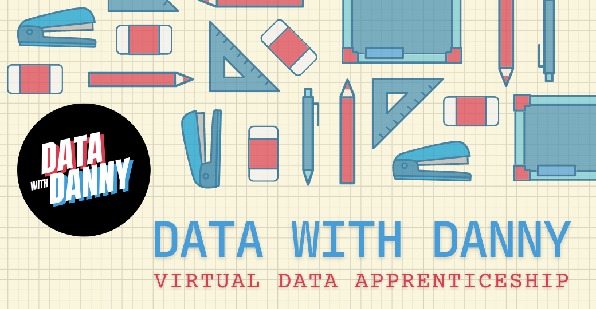
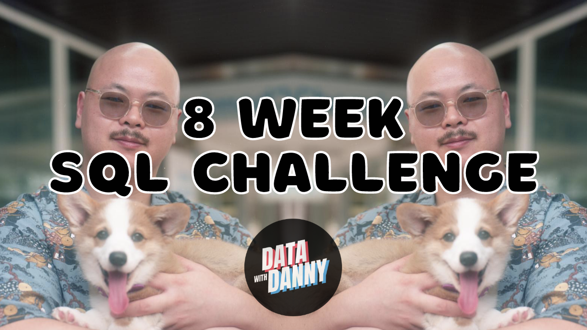

    

# The End & Next Steps!

# Next Steps on Your SQL Journey!

Thank you for your taking this free SQL Masterclass GitHub course! If you've enjoyed this - please consider starring the repo and sharing it with your friends ⭐️

This resource was originally created by [Danny Ma](https://www.linkedin.com/in/datawithdanny/) for the "SQL Masterclass for Data Scientists" half-day live training for the ODSC Asia Pacific 2021 Conference.

# Data With Danny Virtual Data Apprenticeship

 

If you're interested in learning valuable data science skills with Danny directly - you can checkout the [Data With Danny](https://www.datawithdanny.com) website for more details!

Join our private student community with over 1,000 data professionals, join a local study group, get help from our team of 12+ data mentors and learn more about our personalized mentorship initiatives!

The 1st part of the Data With Danny program is Serious SQL which is like this SQL course but on an entirely differently level. If you're serious about learning SQL you won't want to miss this course!

Our first live SQL training cohort begins in November 2021 - you can gain all access to course content, recorded videos, our private Discord and more for a one off payment of only $49 - find out more [here!](https://www.datawithdanny.com/courses/serious-sql)

*Click on the image above to open the Data With Danny website in a new tab!*

# 8 Week SQL Challenge Case Studies

 

Want to test your SQL skills and tackle 8 realistic SQL case studies and get access to a collection of free SQL learning resources?

Join the Data With Danny [8 Week SQL Challenge](https://www.8weeksqlchallenge.com/getting-started) for free today!

Solve all 8 realistic SQL case studies designed to simulate real work scenarios and interview questions across multiple analytics domains including customer analytics, digital, banking, retail and subscriptions!

*Click on the image above to open the 8 Week SQL Challenge website in a new tab!*

# About the Instructor: Danny Ma

Danny is the Chief Data Mentor at Data With Danny and the Founder & CEO of Sydney Data Science, a boutique data consultancy based out of Sydney, Australia 🇦🇺

After spending the last 10 years working in almost every single role in the data ecosystem, Danny is now focused on solving difficult problems at scale re-imagining data education and recruitment, and mentoring the next generation of data professionals.

He provides specialist data consultancy services:

* Digital customer analytics and experimentation
* Data and machine learning strategy
* Data engineering and systems design
* Team building for analytics and data science functions
* Technical training for practitioners and management

Danny is a regular speaker at global data conferences, meetups and podcasts where he shares the importance of mentorship for all data professionals. He is
also a technical author and instructor for O'Reilly.

Danny believes that he is living proof that dispels the myth that you need higher level education to be successful in the data science space,
and he wants to share his experiences with others so they can do the same.

*Click on the image above to open Danny's LinkTree in a new tab!*

